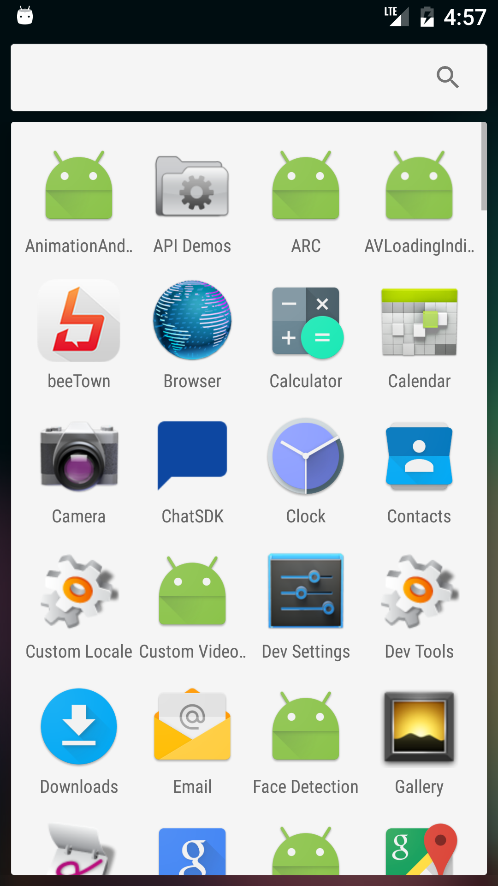

Test the file
===================================

This sample demonstrates how to use basic functionalities of Camera2
API. You can learn how to iterate through characteristics of all the
cameras attached to the device, display a camera preview, and take
pictures.

Introduction
------------

The Link test [Here you can go to google][1] 

This link tranfer you on [camera Manager] Open Camera

[1] http://www.google.com
[2] https://developer.android.com/reference/android/hardware/camera2/CameraManager.html#openCamera(java.lang.String, android.hardware.camera2.CameraDevice.StateCallback, android.os.Handler)Screenshots
-------------

 

Support
-------

- Google+ Community: https://plus.google.com/communities/105153134372062985968
- Stack Overflow: http://stackoverflow.com/questions/tagged/android

License
-------

Copyright 2014 The Android Open Source Project, Inc.

Licensed to the Apache Software Foundation (ASF) under one or more contributor
license agreements.  See the NOTICE file distributed with this work for
additional information regarding copyright ownership.  The ASF licenses this
file to you under the Apache License, Version 2.0 (the "License"); you may not
use this file except in compliance with the License.  You may obtain a copy of
the License at

http://www.apache.org/licenses/LICENSE-2.0

Unless required by applicable law or agreed to in writing, software
distributed under the License is distributed on an "AS IS" BASIS, WITHOUT
WARRANTIES OR CONDITIONS OF ANY KIND, either express or implied.  See the
License for the specific language governing permissions and limitations under
the License.
